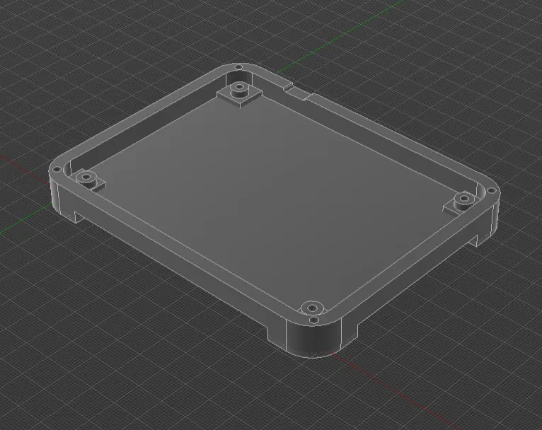
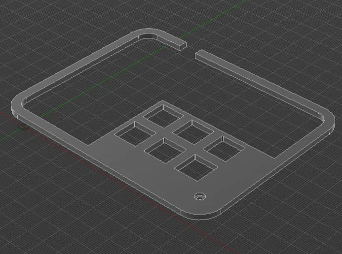
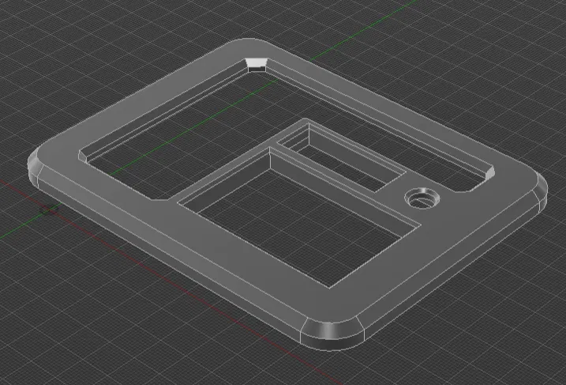

# Maestro
 
A compact 6-key macropad with a rotary encoder and OLED display, built around the Seeeduino XIAO RP2040 and running QMK firmware. Small footprint, fully custom, and 3D printed.
 


 

## Overview
 
This is a 6-key macropad arranged in a 2x3 matrix, with a rotary encoder for analog-style control and a 0.91" OLED for live feedback. It is built on a custom PCB, with the Seeeduino XIAO RP2040 socketed on top. It runs QMK, so every key, layer, and encoder action is fully remappable, and you get access to the entire QMK feature set (layers, tap-dance, macros, combos, RGB if you add it later, and more).
 
The whole thing is housed in a 3D printed case designed to hold the PCB, switches, encoder, OLED, and XIAO board in place.
 
## Features
 
- 6 mechanical switches wired in a 2x3 matrix
- Rotary encoder with push-button (three actions: CW, CCW, press)
- 0.91" OLED display (128x32, SSD1306, I2C) for layer and status readout
- Seeeduino XIAO RP2040 microcontroller (USB-C, RP2040 chip)
- Runs QMK firmware with full layer and macro support
- Custom designed PCB with socketed XIAO RP2040
- 3D printed three-part case (base + plate + cover)
---
## HARDWARE

| Component | Details |
|-----------|---------|
| Microcontroller | Seeeduino XIAO RP2040 (RP2040, USB-C) |
| Switches | 6x MX-style mechanical switches |
| Matrix | 2 rows x 3 columns |
| Diodes | 6x 1N4148 (one per switch, SMD or through-hole per PCB) |
| Encoder | EC11 rotary encoder with push switch |
| Display | 0.91" OLED, 128x32, SSD1306 driver, I2C interface |
| PCB | Custom designed board with XIAO socket footprint |
| Case | 3D printed plate and base |
| Cable | USB-C |
 
  
## Bill of Materials
 
- 1x Seeeduino XIAO RP2040
- 6x MX-style switches
- 6x 1N4148 diodes
- 1x EC11 rotary encoder + knob
- 1x 0.91" SSD1306 OLED (I2C, 4-pin)
- 1x custom PCB
- 3D printed case (top + plate + base)
- USB-C cable

 
## PCB and Assembly
 
All routing lives on the custom PCB. Solder the components and flash the SEEEDUINO XIAO RP2040 once done.

*Note: Be careful about the order of the 1N4148 diodes. Current flows only one way.*  

### Matrix
 
The 6 switches form a 2x3 matrix routed on the PCB. Each switch has a diode (1N4148) in series to prevent ghosting during matrix scan. Diode orientation is fixed by the PCB footprint, so follow the silkscreen (band lines up with the marked pad). This matches `diode_direction` in the QMK config (`COL2ROW`).
 
### OLED (I2C)
 
The OLED connects over I2C to the XIAO SDA/SCL pins broken out on the board. VCC to 5v, GND to GND. Match the header on the PCB.
 
### Encoder
 
The EC11 footprint routes the two rotation pins and the push switch to their assigned GPIOs on the board.
 
---
 
## FIRMWARE (QMK)

This board runs QMK. The keyboard definition lives in this repo under
[`Firmware/keyboards/maestro`](Firmware/keyboards/maestro) and is fully
data-driven (`keyboard.json`) — there are no separate `<keyboard>.c` / `.h`
board files to maintain.

Because `maestro` is not part of upstream QMK, you link this repo's keyboard
folder into your local QMK checkout once, then build normally. This keeps a
single source of truth (this repo) with no file copying.

### 1. Set up QMK

If you haven't already, install QMK and its toolchain:

```bash
qmk setup
```

On **Windows**, run all `qmk` commands inside the **QMK MSYS** terminal that is
installed with QMK (not PowerShell or CMD).

### 2. Link this keyboard into your QMK tree

Clone this repo, then link `qmk_firmware/keyboards/maestro` to the keyboard
folder here. Helper scripts are included:

**Windows** (PowerShell — no admin needed, uses a directory junction):

```powershell
cd Firmware\Link
.\link-keyboard.ps1                                  # auto-detects ~\qmk_firmware
# or: .\link-keyboard.ps1 -QmkHome "D:\path\to\qmk_firmware"
```

**macOS / Linux:**

```bash
cd Firmware/Link
./link-keyboard.sh                                   # auto-detects ~/qmk_firmware
# or: ./link-keyboard.sh /path/to/qmk_firmware
```

<details>
<summary>Or link it manually</summary>

```bash
# macOS / Linux
ln -s "$(pwd)/Firmware/keyboards/maestro" ~/qmk_firmware/keyboards/maestro
```

```powershell
# Windows PowerShell
New-Item -ItemType Junction `
  -Path "$HOME\qmk_firmware\keyboards\maestro" `
  -Target "$((Resolve-Path .\Firmware\keyboards\maestro).Path)"
```
</details>

### 3. Build

```bash
qmk compile -kb maestro -km default
```

The compiled `maestro_default.uf2` is written to the root of your `qmk_firmware`
folder.

### 4. Flash

Put the XIAO RP2040 into bootloader mode (double-tap reset, or hold BOOT while
plugging in). It mounts as an `RPI-RP2` drive. Either drag the `.uf2` onto that
drive, or run:

```bash
qmk flash -kb maestro -km default
```

### Enabled features

Configured in
[`keyboard.json`](Firmware/keyboards/maestro/keyboard.json) and
[`rules.mk`](Firmware/keyboards/maestro/rules.mk):

- **Rotary encoder** — turn = volume up/down, press = mute
- **OLED** — 128x32 SSD1306 over I2C
- **Raw HID** (`RAW_ENABLE`) — lets the companion app stream text to the OLED
- **NKRO**, **extrakeys** (media keys), and **bootmagic**

> **Editor note:** if VS Code shows red squiggles in `keymap.c`
> (`uint16_t is undefined`, `expected a file name` on `#include QMK_KEYBOARD_H`,
> etc.), those are IntelliSense errors, not compile errors — the editor can't
> resolve QMK's macros/includes. They do not affect `qmk compile`. Running
> `qmk generate-compilation-database -kb maestro -km default` produces a
> `compile_commands.json` that clears them up.

## Example Keymap Ideas
 
- Copy, paste, undo on the main layer
- Encoder for volume up/down, press to mute
- A second layer for media controls (play/pause, next, previous)
- App launchers or window management shortcuts
- OBS scene switching
- Discord mute/deafen
Because it runs QMK, you can add tap-dance, hold-tap, and multiple layers to get far more than 6 functions out of 6 keys.
 
 
## OLED Display
 
The 0.91" OLED can show whatever you program in `oled_task_user()`. Common uses:
 
- Current active layer
- Caps/lock status
- A logo or small animation
- Encoder mode indicator
Keep in mind the 128x32 resolution is small, so stick to short text or compact bitmaps.

## OLED Companion App

OLED Display cant fetch data itself (keyboard has no internet). A Small external companion app runs on the host computer, reads current Spotify track, pushes to pad over raw HID through app. See [`Firmware/companion`](Firmware/companion).

- Spotify playing: OLED shows song and artist.
- Spotify idle: OLED shows current time and date.

Firmware just displays what app sends. Packet format: byte 0 = line number (0-3), rest = text string.

Requires `RAW_ENABLE = yes` in `rules.mk`.
 
---   
 
## CAD


3D printed, three stacked layers:

- Base layer: tray with raised perimeter wall, four corner screw posts, USB-C notch on side. Houses PCB, secured with screws through corner posts.



- Plate layer: flat sheet with six square switch cutouts in 2x3 grid and raised border wall. Fixed with single screw at bottom, plus optional superglue for extra hold.



- Top layer: frame with large open window to showcase PCB, dedicated cutout slot for OLED and rotary encoder, screw hole, chamfered corners.



Print in any filament and color. PLA fine for desk device.

---

 
## Notes
 
- Match your matrix and encoder pins in `keyboard.json` / `config.h` to the PCB routing before flashing.
- If the OLED does not light up, confirm the I2C address (usually `0x3C`) and the header orientation.
- If keys ghost or repeat, check diode placement and matrix definitions.


 
## Credits
 
Built and wired by hand, powered by QMK.
