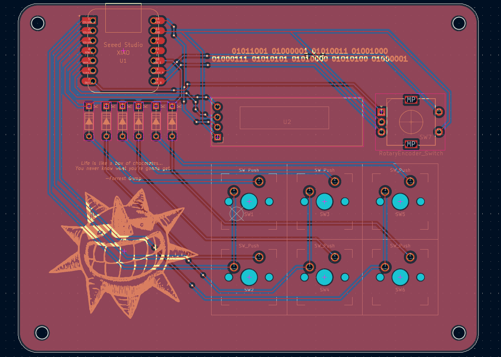
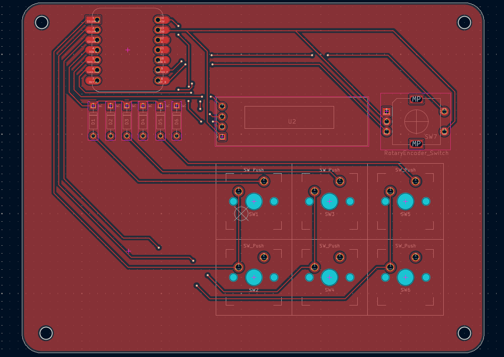
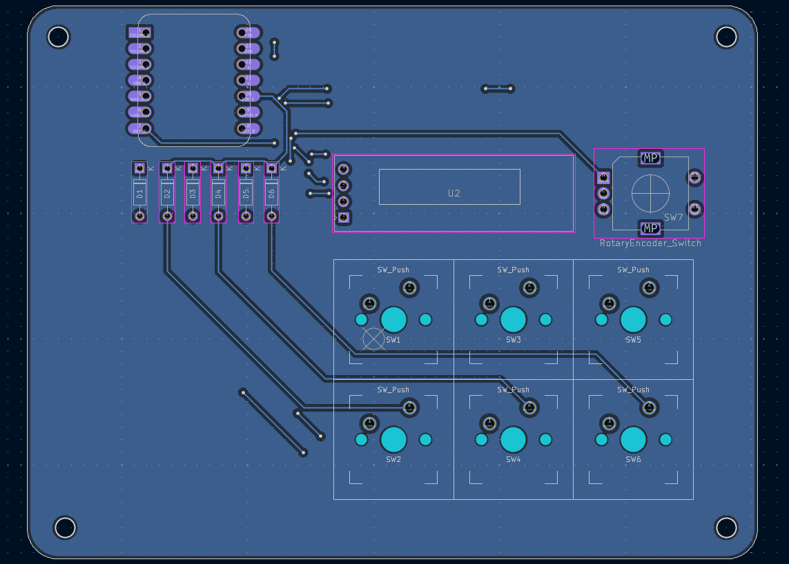
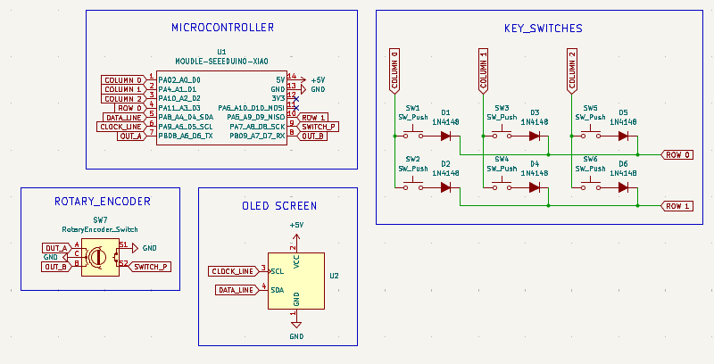
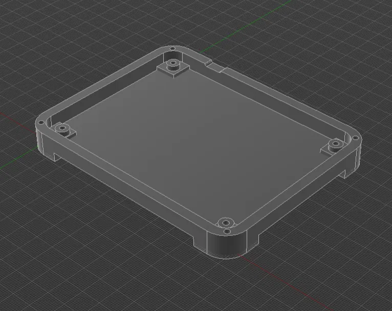
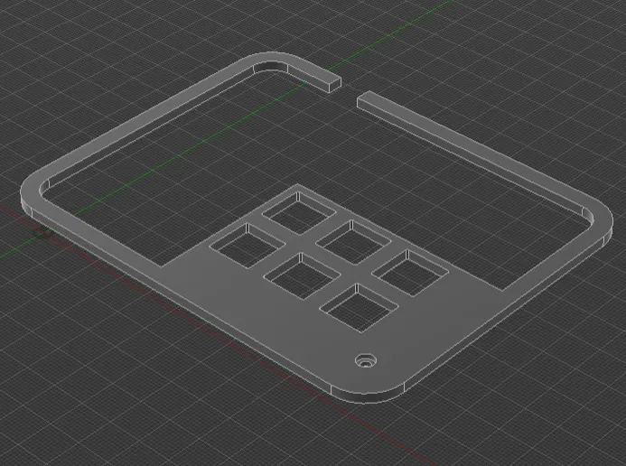
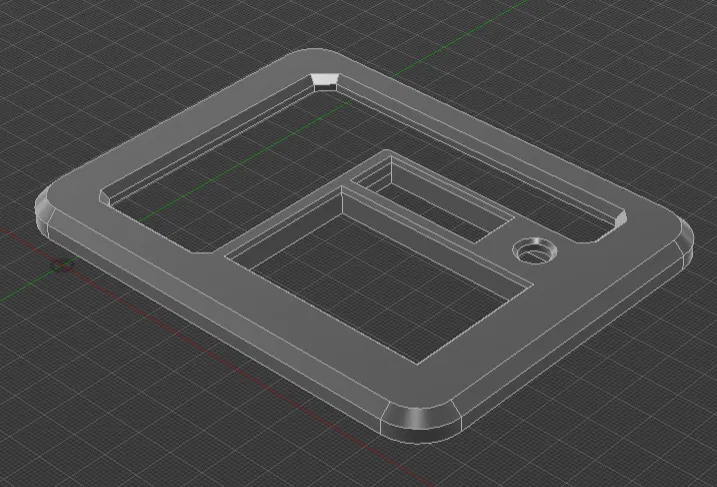

# Maestro
 
A compact 6-key macropad with a rotary encoder and OLED display, built around the Seeeduino XIAO RP2040 and running QMK firmware. Small footprint, fully custom, and 3D printed.


## Overview
 
This is a 6-key macropad arranged in a 2x3 matrix, with a rotary encoder for analog-style control and a 0.91" OLED for live feedback. It is built on a custom PCB, with the Seeeduino XIAO RP2040 socketed on top. It runs QMK, so every key, layer, and encoder action is fully remappable, and you get access to the entire QMK feature set (layers, tap-dance, macros, combos.
 
The whole thing is housed in a 3D printed case designed to hold the PCB, switches, encoder, OLED, and XIAO board in place.

<p align="center">
   
</p>
<p align="center">
  
 
</p>
<p align="center">
   
</p>
## Features
 
- 6 mechanical switches wired in a 2x3 matrix
- Rotary encoder with push-button
- 0.91" OLED display for layer and status readout
- Seeeduino XIAO RP2040 microcontroller
- Runs QMK firmware with full layer and macro support
- Custom designed PCB with socketed XIAO RP2040
- 3D printed three-part case


  
## Bill of Materials
|Amount|Part|
|-|-|
|1x|Seeeduino XIAO RP2040|
|6x|MX-style switches|
|6x|1N4148 diodes|
|1x|EC11 rotary encoder + knob|
|1x|0.91" SSD1306 OLED (I2C, 4-pin)|
|1x|custom PCB|
|1x|3D printed case (top + plate + base)|
|1x|USB-C cable|
 
## FIRMWARE (QMK)
### 1. Set up QMK

If you haven't already, install QMK and its toolchain:

```bash
qmk setup
```

On Windows, run all *qmk* commands inside the *QMK MSYS* terminal that is
installed with QMK.

### 2. Link this keyboard into your QMK tree

Clone this repo, then link `qmk_firmware/keyboards/maestro` to the keyboard
folder here. 

**Useful scripts:**

**Windows**:

```powershell
cd Firmware\Link
.\link-keyboard.ps1                                  
```
*or :*
```powershell
.\link-keyboard.ps1 -QmkHome "D:\path\to\qmk_firmware"
```

### 3. Build
```bash
qmk compile -kb maestro -km default
```

The compiled maestro_default.uf2 is written to the root of your qmk_firmware folder.

### 4. Flash

Put the XIAO RP2040 into bootloader mode. Either drag the `.uf2` onto that drive, or run:

```bash
qmk flash -kb maestro -km default
```


 
## OLED Display
 
The 0.91" OLED can show whatever you program in `oled_task_user()`. Common uses:
 
- Current active layer
- Caps/lock status
- A logo or small animation
- Encoder mode indicator

*Keep in mind the 128x32 resolution is small, so stick to short text or compact bitmaps.*

## OLED Companion App

OLED Display cant fetch data itself (keyboard has no internet). A Small external companion app runs on the host computer, reads current Spotify track, pushes to pad over raw HID through app.

- Spotify playing: OLED shows song and artist.
- Spotify idle: OLED shows current time and date.

Firmware just displays what the app sends.

**Requires RAW_ENABLE = yes in rules.mk.**
 
---   
 
## CAD


3D printed, three stacked layers:

- Base layer: tray with raised perimeter wall, four corner screw posts, USB-C notch on side. Houses PCB, secured with screws through corner posts.



- Plate layer: flat sheet with six square switch cutouts in 2x3 grid and raised border wall. Fixed with single screw at bottom, plus optional superglue for extra hold.



- Top layer: frame with large open window to showcase PCB, dedicated cutout slot for OLED and rotary encoder, screw hole, chamfered corners.




---

 
## Notes
 
- Match your matrix and encoder pins in keyboard.json / config.h to the PCB routing before flashing.
- If the OLED does not light up, confirm the I2C address (usually 0x3C) and the header orientation.
- If the keys ghost or repeat, check diode placement and matrix definitions.
